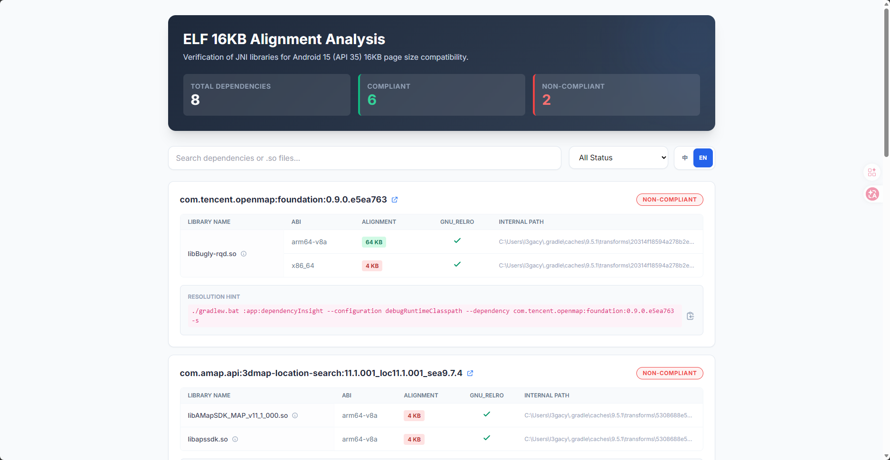

# ELF 16K Alignment Gradle Plugin

[](LICENSE)
[](https://kotlinlang.org)
[](https://gradle.org)
[](https://developer.android.com/studio/releases/gradle-plugin)
[](https://docs.gradle.org/current/userguide/configuration_cache.html)

[English](README.md) | 中文

## 📖 简介

`elf-16k-alignment` 是一个专为 Android 开发者设计的 Gradle 插件，用于检测项目依赖（AAR）中的原生库（JNI
`.so` 文件）是否符合 **16KB 页面对齐**要求。

随着 Android 15 开始支持 16KB 页面大小（Page Size），所有包含原生代码的应用必须确保其 ELF 文件按照 16KB
边界对齐，否则应用在 16KB 模式的设备上将无法运行。

本插件可以自动扫描项目中的所有 AAR 依赖，识别出未对齐的 `.so` 文件，并生成详细的检测报告，帮助开发者快速定位并推动
SDK 供应商进行修复。



## ✨ 功能特性

- 🔍 **全自动扫描**: 自动识别项目运行时依赖中包含 JNI 库的 AAR。
- 📏 **对齐检测**: 检查 ELF 文件的 `p_align` 属性，验证是否达到 16KB（16384L）对齐。
- 🛡️ **RELRO 检查**: 同时检测是否启用 GNU_RELRO，提高安全性。
- 📊 **多格式报告**: 提供控制台摘要输出，并在发现未对齐库时给出警告。支持生成 CSV、HTML 和 JSON 格式的离线报告。
- 🚀 **构建集成**: 可配置在构建过程中（`mergeNativeLibs` 之前）自动运行，确保及时发现问题。
- 🎯 **智能过滤**: 支持仅显示未对齐的库，减少干扰信息。
- 🛠️ **快速排查**: 提供 `dependencyInsight` 指令建议，方便定位依赖来源。

## 🚀 快速开始

### 1. 添加插件到项目

在根目录的 `build.gradle.kts` 中添加插件路径：

```kotlin
buildscript {
    dependencies {
        classpath("io.github.5peak2me.gradle:elf-16k-alignment:0.0.4")
    }
}
```

或者使用 `plugins` DSL：

```kotlin
plugins {
    id("elf-16k-alignment") version "0.0.4"
}
```

或者使用 Version Catalog (`libs.versions.toml`)：

在 `gradle/libs.versions.toml` 中添加：

```toml
[plugins]
elf-alignment = { id = "elf-16k-alignment", version = "0.0.4" }
```

并在项目根目录的 `build.gradle.kts` 中配置：

```kotlin
plugins {
    alias(libs.plugins.elf.alignment) apply false
}
```

### 2. 在 App 模块中应用插件

在 `app/build.gradle.kts` 中应用插件并进行配置：

```kotlin
plugins {
    id("com.android.application")
    id("elf-16k-alignment")
}

elfAlignment {
    // 设置期望的最大对齐数，默认为 16384 (16KB)
    maxAlign.set(16384L)

    // 是否在每次 Build 时自动运行检测，默认为 true
    resolveOnBuild.set(true)

    // 配置输出格式
    output {
        csv.set(true)
        html.set(true)
        json.set(true)
    }
}
```

### 3. 执行检测任务

你可以手动执行检测任务：

```bash
./gradlew analyzeDebugAlignment
```

任务执行完成后，报告将生成在 `app/build/reports/elf-16k-alignment/<variant>/` 目录下。

## 🔧 配置参数说明

| 参数               | 类型        | 默认值      | 说明                                                |
|:-----------------|:----------|:---------|:--------------------------------------------------|
| `maxAlign`       | `Long`    | `16384L` | 目标对齐边界（字节）。Android 15 建议 16KB。                    |
| `resolveOnBuild` | `Boolean` | `true`   | 是否挂载到构建生命周期。若为 `true`，会在 `mergeNativeLibs` 任务前执行。 |
| `output.csv`     | `Boolean` | `false`  | 是否生成 CSV 格式报告。                                    |
| `output.html`    | `Boolean` | `false`  | 是否生成 HTML 格式报告。                                   |
| `output.json`    | `Boolean` | `false`  | 是否生成 JSON 格式报告。                                   |

## 🤝 贡献与反馈

欢迎提交 Issue 和 Pull Request！

- 报告问题: [Issues](https://github.com/5peak2me/elf-16k-alignment/issues)

## 📄 许可证

本项目采用 [Apache License 2.0](LICENSE) 许可证。
